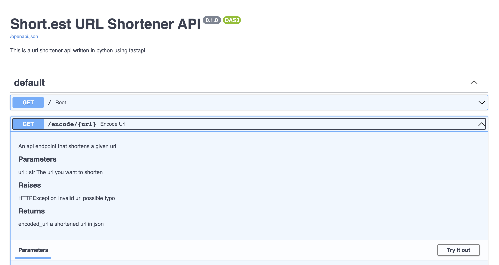
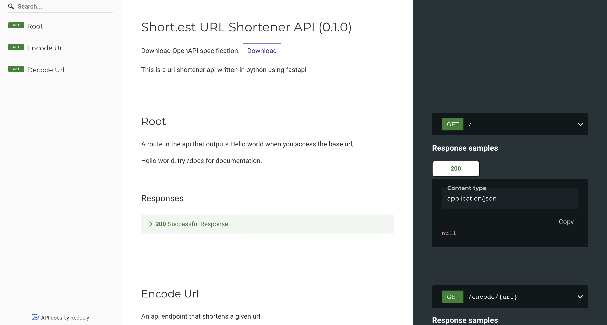

# Documentation

This project is a test api in python that creates shortened url.

-------
## Installation
### Prerequisites 

In order to run this code you need to have these installed on your machine: 
- Python 3.9, Python3
- Pip3
- Uvicorn or similar 


You can check these by typing this code into your terminal
```shell
python3 --version 
```
```shell
pip3 --version
```
```shell
uvicorn --version
```

### Clone Project

Navigate into the directory of your choice and clone the repository. Then run following commands: 

```shell
git clone git@github.com:wedalb/link-shortening-api.git
```

### Installing the requirements

Install the requirements text:

```shell
python -m pip install -r requirements.txt
```
---
# Usage 
### Start Uvicorn
Run uvicorn to be able to try out the endpoints and make requests
```shell
cd default-python-xgjeuv/src

uvicorn api:app --reload
``` 

Then in your browser, postman or similar you can try out the endpoints.

For trying out the endpoints I recommend the browser or terminal 

#### Browser: 
Open one of the following addresses in your browser. This will redirect you to a documentation website 
that tells you everything about the endpoints. Also, you can press the "Try it out" button and try the api 
```
http://127.0.0.1:8000/docs 
```

```
http://127.0.0.1:8000/redoc
```



#### Terminal 
You can open a second window for the terminal and try the following code to encode an url 
```shell
curl http://127.0.0.1:8000/encode/htttp://example-url.org
```

This will return: 
```json
  {
    "encoded_url": "http://short.est/2KRT7a"
  }
```

After that you can try 
```shell
curl http://127.0.0.1:8000/decode/http://short.est/2KRT7a
```

And it shall return

```json
  {
    "decoded_url": "example-url.org"
  }
```

### Running tests

To run test simply stay in the directory and run

> pytest

### Libraries

- FastApi 
- Pythons random function
- pydantic
- pytests